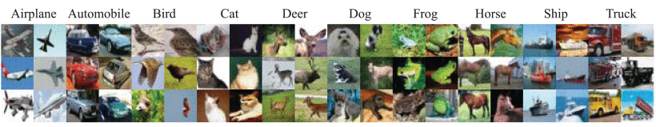
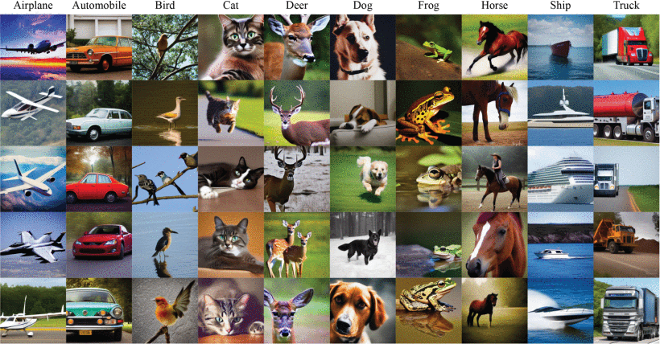
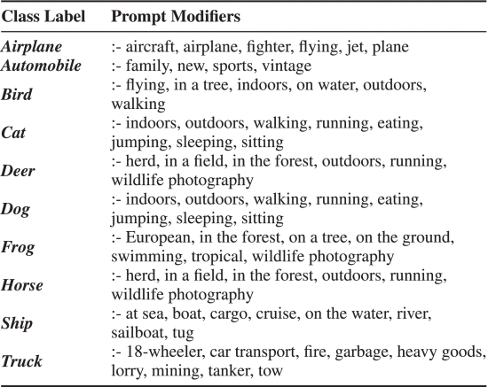

# Dataset Card for CIFAKE

CIFAKE is a binary image classification dataset built to study whether computer vision models can distinguish real images from AI-generated synthetic images. It combines the [CIFAR-10](https://cave.cs.toronto.edu/kriz/cifar.html) dataset with a matching set of generated images created with a diffusion model, giving a clean, balances benchmark for real vs fake photo detection. 

## Dataset Details

### Dataset Description

The CIFAKE dataset contains a mix of 60,000 synthetically generated images and 60,000 real images sourced from CIFAR-10. It is designed for computer vision tasks and techniques related to AI generated image detection. 

The dataset contains two classes that define image origin: `REAL` and `FAKE`. The `REAL` images originate from Krizhevsky & Hinton's CIFAR-10 dataset, while the `FAKE` images were generated using [Stable Diffusion v1.4](https://openaccess.thecvf.com/content/CVPR2022/papers/Rombach_High-Resolution_Image_Synthesis_With_Latent_Diffusion_Models_CVPR_2022_paper.pdf). The same ten CIFAR-10 semantic categories (e.g., airplane, automobile, bird, cat) were used for the generated images so that both classes cover the same semantic categories.

- **Created by:** Jordan J. Bird and Ahmad Lotfi
- **Shared by:** Jordan J. Bird (via Kaggle)
- **License:** MIT

### Dataset Sources 

<!-- Provide the basic links for the dataset. -->

- **Dataset:** [CIFAKE on Kaggle](https://www.kaggle.com/datasets/birdy654/cifake-real-and-ai-generated-synthetic-images)
- **Paper:** [Bird, J. J., & Lotfi, A. (2024). *CIFAKE: Image Classification and Explainable Identification of AI-Generated Synthetic Images*. IEEE Access, 12, 15642–15650.](https://doi.org/10.1109/ACCESS.2024.3356122)

## Uses

<!-- Address questions around how the dataset is intended to be used. -->

### Intended Use

According to Bird & Lotfi (2024), CIFAKE was released as a research resource for the development and testing of computer vision approaches to AI-generated image recognition. The authors use the dataset to train and evaluate classifiers that distinguish between real and synthetically generated images.

The dataset is also intended to support research into Explainable AI (XAI), particularly the interpretation and visualization of features used by models to identify synthetic images. The authors further encourage future research using alternative classification approaches on the provided dataset.

### Use in GAN-Busters

In GAN-Busters, CIFAKE is used as the primary dataset for training and evaluating a binary image classifier that distinguishes between `REAL` and `FAKE` images.

GAN-Busters is an educational MLOps project developed for the Advanced Topics in Data Engineering II (TAED2) course at the Universitat Politècnica de Catalunya (UPC). The dataset is used within a reproducible MLOps workflow covering data versioning, experiment tracking, model training, evaluation, and deployment.

Additional external datasets may be used exclusively for evaluating model generalization beyond the CIFAKE distribution, including images from different semantic domains, resolutions, and generative models. Any external datasets used for this purpose will be documented separately, including their source, composition, and role in evaluation.

## Dataset Structure

<!-- This section provides a description of the dataset fields, and additional information about the dataset structure such as criteria used to create the splits, relationships between data points, etc. -->
The CIFAKE dataset contains 120,000 RGB images of 32×32 pixels, divided equally between the `REAL` and `FAKE` classes.

The Kaggle distribution provides two predefined directories:

| Directory | REAL | FAKE | Total |
|------------|-----:|-----:|------:|
| `train` | 50,000 | 50,000 | 100,000 |
| `test` | 10,000 | 10,000 | 20,000 |
| **Total** | **60,000** | **60,000** | **120,000** |

The directory structure is:

```text
CIFAKE/
├── train/
│   ├── REAL/
│   └── FAKE/
└── test/
    ├── REAL/
    └── FAKE/
```

Each `REAL` and `FAKE` subset contains images from the same ten semantic categories inherited from CIFAR-10: airplane, automobile, bird, cat, deer, dog, frog, horse, ship, and truck.

Within the training split, each semantic category is represented by 5,000 images in `train/REAL` and 5,000 images in `train/FAKE`. Within the test split, each category is represented by 1,000 images in `test/REAL` and 1,000 images in `test/FAKE`.

Therefore, both the binary classes (`REAL`/`FAKE`) and the ten semantic categories are uniformly distributed within each predefined split.

### Image Examples

The following figures show examples from the ten semantic categories represented in each binary class.

#### REAL — CIFAR-10



*Examples of CIFAR-10 images representing the ten semantic categories used in CIFAKE. Source: Bird & Lotfi (2024), Figure 1.*

#### FAKE — Stable Diffusion v1.4



*Examples of synthetically generated images representing the ten CIFAKE semantic categories. Source: Bird & Lotfi (2024), Figure 2.*

### Predefined Split Terminology

Although the second directory is named `test` in the Kaggle distribution, its Kaggle metadata describes it as containing **validation data**. This creates ambiguity regarding the intended role of this split and should be considered when interpreting or reproducing the experimental setup described by the original authors.


*Figure: CIFAKE's Kaggle distribution names the directory `test` while describing it as containing validation data.*

## Dataset Creation

### Curation Rationale

<!-- Motivation for the creation of this dataset. -->

Bird & Lotfi (2024) created CIFAKE in response to the rapid improvement of generative image models, which has made it increasingly difficult for humans to distinguish AI-generated images from real images. The dataset was released as a research resource for the development and testing of computer vision approaches to AI-generated image recognition. 

### Source Data

<!-- This section describes the source data (e.g. news text and headlines, social media posts, translated sentences, ...). -->
CIFAKE combines real images from the existing CIFAR-10 dataset with synthetic images generated specifically for CIFAKE. Both groups represent the same ten semantic categories: airplane, automobile, bird, cat, deer, dog, frog, horse, ship, and truck.

#### Data Collection and Processing

<!-- This section describes the data collection and processing process such as data selection criteria, filtering and normalization methods, tools and libraries used, etc. -->

- **`REAL`:** The 60,000 real images originate from the existing [CIFAR-10](https://cave.cs.toronto.edu/kriz/cifar.html) dataset ([Krizhevsky & Hinton, 2009])(https://cave.cs.toronto.edu/kriz/learning-features-2009-TR.pdf). CIFAR-10 consists of 32×32 RGB images distributed across ten semantic classes.

- **`FAKE`:** The 60,000 synthetic images were generated by Bird & Lotfi using [Stable Diffusion v1.4](https://openaccess.thecvf.com/content/CVPR2022/papers/Rombach_High-Resolution_Image_Synthesis_With_Latent_Diffusion_Models_CVPR_2022_paper.pdf). The authors generated 6,000 images for each of the ten CIFAR-10 semantic categories.

  Generation prompts followed the structure `"a photograph of a/an [class]"` and incorporated class-specific prompt modifiers to introduce variation within each category. The modifiers were used equally across the 6,000 generated images for each class.



*Prompt modifiers used by Bird & Lotfi (2024) to generate the ten classes of synthetic images. Source: Bird & Lotfi (2024), Table 1.*

  The synthetic images were initially generated at 512×512 pixels using 50 denoising steps and the Euler Ancestral scheduler. They were subsequently downsampled to 32×32 pixels using bilinear interpolation to match the dimensions of the CIFAR-10 images.


#### Personal and Sensitive Information

<!-- State whether the dataset contains data that might be considered personal, sensitive, or private (e.g., data that reveals addresses, uniquely identifiable names or aliases, racial or ethnic origins, sexual orientations, religious beliefs, political opinions, financial or health data, etc.). If efforts were made to anonymize the data, describe the anonymization process. -->

CIFAKE was not created for the collection or analysis of personal or sensitive information. The dataset consists of low-resolution images across the ten CIFAR-10 semantic categories and does not provide personal identifiers or associated personal metadata.

## Bias, Risks, and Limitations

<!-- This section is meant to convey both technical and sociotechnical limitations. -->

- **Limited generative model diversity:** All `FAKE` images were generated using [Stable Diffusion v1.4](https://openaccess.thecvf.com/content/CVPR2022/papers/Rombach_High-Resolution_Image_Synthesis_With_Latent_Diffusion_Models_CVPR_2022_paper.pdf). Models trained and evaluated exclusively on CIFAKE may therefore learn artifacts specific to this generator rather than features that generalize to images produced by other or newer generative models. As image-generation techniques continue to evolve, performance obtained on CIFAKE may not reflect performance on more recent synthetic images. Bird & Lotfi (2024) identify updating the dataset with images generated by future approaches as an area for future work.

- **Duplicate synthetic images:** The data integrity pipeline identified 1,336 duplicate FAKE images, including 378 cases of cross-split leakage, while no duplicates were found among REAL images. The use of a generative model to create the synthetic data may contribute to repeated outputs. If duplicates occur across training and test sets, performance on unseen data may be overestimated. The pipeline therefore removes exact duplicates and prevents cross-split leakage.

- **Low image resolution:** The 32x32 image size is much lower than typical real world images, which limits how well findings transfer to full-resolution AI-generated image detection. 

- **Restricted semantic domain:** CIFAKE contains only the ten semantic categories inherited from CIFAR-10. Performance on these categories does not establish generalization to other image domains. Bird & Lotfi (2024) identify additional domains, such as human faces and clinical scans, as potential areas for future expansion.

- **Validation/test split ambiguity:** The predefined `test` directory in the Kaggle distribution is described in its metadata as containing validation data. This makes the intended distinction between validation and final test data unclear. If this split was used for model selection or architecture comparison in the original experiments, the reported performance of the selected models may be optimistic with respect to truly unseen data. 

### Recommendations

<!-- This section is meant to convey recommendations with respect to the bias, risk, and technical limitations. -->

CIFAKE should primarily be treated as a research and benchmark dataset for studying AI generated image detection. Performance obtained using CIFAKE alone should not be assumed to generalize to real world AI generated images. For real world deployment, models should be validated on more diverse, higher resolution, and more recent datasets covering multiple generative models and image domains. 

Given the ambiguity between validation and test terminology in the original dataset, it is recommended to preserve the provided `test` split as unseen evaluation data. A separate validation set should instead be created from the provided `train` split and used for model selection, hyperparameter tuning, and decision-threshold selection.

## Citation

The CIFAKE authors request that users of the dataset cite both the CIFAKE publication and the original CIFAR-10 source.

### CIFAKE

```bibtex
@article{bird2024cifake,
  title={CIFAKE: Image Classification and Explainable Identification of AI-Generated Synthetic Images},
  author={Bird, Jordan J. and Lotfi, Ahmad},
  journal={IEEE Access},
  volume={12},
  pages={15642--15650},
  year={2024},
  publisher={IEEE}
}
```

### CIFAR-10

```bibtex
@techreport{krizhevsky2009learning,
  title={Learning Multiple Layers of Features from Tiny Images},
  author={Krizhevsky, Alex and Hinton, Geoffrey},
  institution={University of Toronto},
  year={2009}
}
```

## Dataset Card Authors 
- Maribel Yazmin Preite: mayp@itu.dk ; maribel.yazmin.preite@estudiantat.upc.edu
- Luis Antonio Salinas: luis.antonio.salinas@estudiantat.upc.edu
- Rebeca Torrecilla: rebeca.torrecilla@estudiantat.upc.edu
- Aina Vila: aina.vila.arbusa@estudiantat.upc.edu


